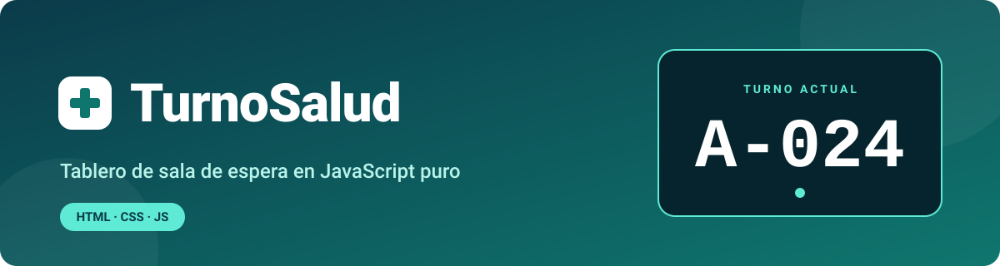
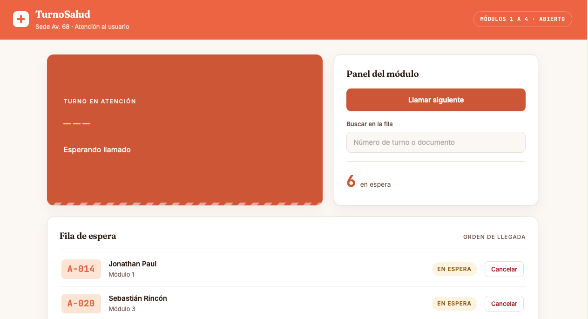

# TurnoSalud



### Un visor claro. Una fila ordenada. Cero confusión en la sala de espera.

**TurnoSalud** es un tablero de turnos construido con **JavaScript puro**: muestra a quién se está atendiendo, cuántas personas faltan y permite buscar un turno en tiempo real. Sin frameworks. Sin librerías.

<br>


<br>


<a href="https://pauljonadev.github.io/TurnoSalud/">
  
</a>
<br><br>


[🎯 El problema](#-el-problema) · [💡 La solución](#-la-solución) · [✨ Funciones](#-qué-hace-turnosalud) · [🧠 Lo técnico](#-lo-técnico) · [🚀 Probarlo](#-probarlo-en-local)

</div>

<br>

<details>
<summary><b>👆 Haz clic: ¿cómo se usa en 3 pasos?</b></summary>

<br>

1. 👀 **Mira el visor:** el turno que se está atendiendo se ve en grande.
2. 🔎 **Busca tu turno** en la fila con el buscador; la lista se filtra mientras escribes.
3. 📣 **Se llama el siguiente turno:** el visor y el contador de la fila se actualizan al instante.

</details>

<br>

---

## 🎯 El problema

En una sala de espera, la incertidumbre es lo que desespera.

- **Para los pacientes:** no saben cuánto falta, si ya pasó su turno o si deben preguntar en el mostrador.
- **Para el personal:** responden la misma pregunta cien veces al día: *"¿ya va a ser mi turno?"*.

## 💡 La solución

TurnoSalud pone la información en un solo tablero: el turno actual siempre visible, la fila completa a la vista y un contador que dice cuántas personas siguen esperando. Todo se actualiza solo, sin recargar la página.

---

## ✨ Qué hace TurnoSalud

| Función | Beneficio |
|---|---|
| 🖥️ **Visor de turno actual** | Todos ven quién está siendo atendido, sin preguntar |
| 📋 **Fila de espera dinámica** | La lista se dibuja a partir de los datos, no está escrita a mano |
| 🔎 **Buscador en tiempo real** | Encuentra un turno filtrando mientras escribes |
| 🔢 **Contador de la fila** | Sabes cuántas personas faltan en todo momento |
| 📣 **Llamar turno** | Al avanzar, visor y contador se sincronizan automáticamente |


<div align="center">
  
</div>
-->

---

## 🧠 Lo técnico

> **Transparencia:** la estructura HTML/CSS viene de una plantilla base del currículo. **Toda la lógica en JavaScript es mi trabajo**: datos, renderizado, eventos y estado.

<details>
<summary><b>Ver los conceptos aplicados</b></summary>

<br>

| Concepto | Dónde se aplica |
|---|---|
| Array de objetos como fuente de datos | `const turnos = [...]` en `app.js` |
| Renderizado dinámico de listas | `pintarFila()` recorre el array y crea un `<li>` por cada turno |
| Búsqueda y filtrado en tiempo real | Listener de evento sobre el input `#buscador` |
| UI reactiva al estado | `#contadorFila` y `#visorNumero` se actualizan al llamar un turno |
| Manipulación del DOM | `getElementById`, `createElement`, `innerHTML` |

</details>

**Decisión consciente:** sin frameworks a propósito. Quería entender qué hace el navegador antes de dejar que una herramienta lo haga por mí.

---

## 🗂️ Estructura

```
TurnoSalud/
├── index.html    # Estructura: visor, panel de control, fila de espera
├── styles.css    # Estilos del tablero
└── app.js        # Lógica: datos, renderizado, eventos
```

---

## 🚀 Probarlo en local

No requiere instalación ni build:

```bash
git clone https://github.com/PaulJonaDev/TurnoSalud.git
cd TurnoSalud
# abre index.html directamente en tu navegador
```

---

## 🛠️ Siguientes pasos

- [ ] Persistencia real: hoy los datos viven en un array en memoria
- [ ] Sonido o aviso visual al llamar un turno
- [ ] Reutilizar el tablero como componente dentro de un proyecto mayor

---

<div align="center">

Hecho por **Jonathan David Paul Caraballo** · [GitHub](https://github.com/PaulJonaDev) · [LinkedIn](https://www.linkedin.com/in/pauljonadev)

</div>
